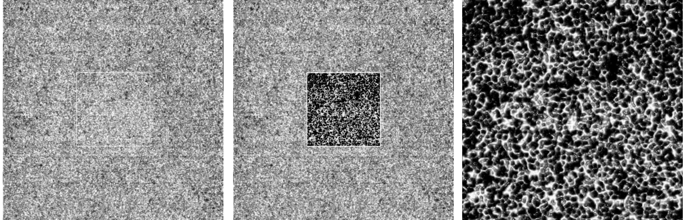
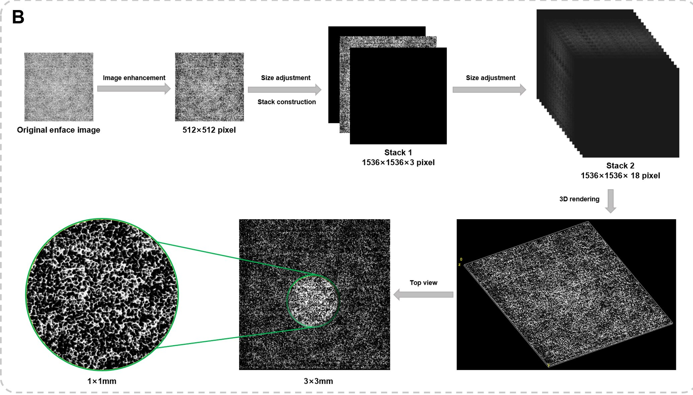
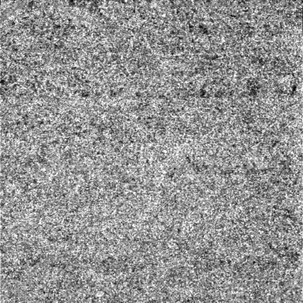
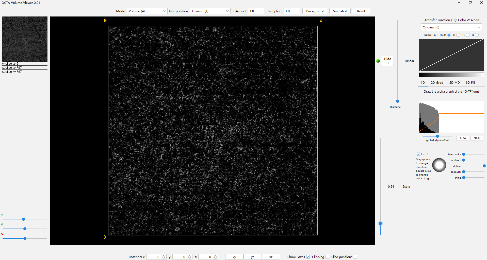

# ImageJ Ophthalmology Choroidal Vascular OCTA Image 3D Reconstruction Plugin
English | [简体中文](README_cn.md)

### Project Background：
This study aims to restore the longitudinal information of images based on the unique imaging method of enface images on the basis of a single CC layer OCTA enface image, and construct a 3D topographic map that can clearly display the morphology of CC vessels. To verify the effectiveness of the 3D reconstruction algorithm, this plugin was developed. This study also designed the [OCTA_Volumer_Viewer](https://github.com/chw1127/OCTA_Volume_Builder) plugin for real-time display of reconstruction results during the 3D reconstruction process.
### Plugin Introduction:
This project is a custom-developed image processing plugin in ImageJ. It is used in conjunction with another self-developed plugin [OCTA_Volumer_Viewer](https://github.com/chw1127/OCTA_Volume_Builder)

which can realize the 3D visual reconstruction of a single OCTA image and display it in the OCTA_Volumer_Viewer, with the following effects:

### Schematic Diagram of the Principle：

### install
1.Prerequisite: Ensure that Fiji (ImajeJ distribution) has been successfully installed. Download link:[https://imagej.net/software/fiji/](https://imagej.net/software/fiji/)

2.Download the two jar packages of this plugin:
[OCTA_3D_ReBuild_plugin-0.1.0.jar](./deploy/OCTA_3D_ReBuild_plugin-0.1.0.jar) and [OCTA_Volume_Viewer_plugin_2.01.5.jar](./deploy/OCTA_Volume_Viewer_plugin_2.01.5.jar)

3.Copy these two jar packages to the plugins folder in the installation directory of Fiji (ImajeJ distribution).
For example, your local installation directory might be:

    D:\Program Files\Fiji.app-2023\plugins

4、Run the Fiji (ImajeJ distribution) software, and you can see these two plugins in the Plugins drop-down menu: “OCTA_3D_ReBuild” and “OCTA_Volume_Viewer”, indicating successful installation.

### Usage：
1、Run the Fiji (ImajeJ distribution) software

2、Open an OCTA en-Face image, such as:

3、Click on “Plugins/OCTA_3D_ReBuild” in the top menu, and the image processing will be carried out automatically, and it will be previewed in the “OCTA_Volume_Viewer”.

4、Click “OK”, and the final image will be automatically synthesized and the 3D_Viewer plug-in will automatically pop up to preview the 3D effect:

