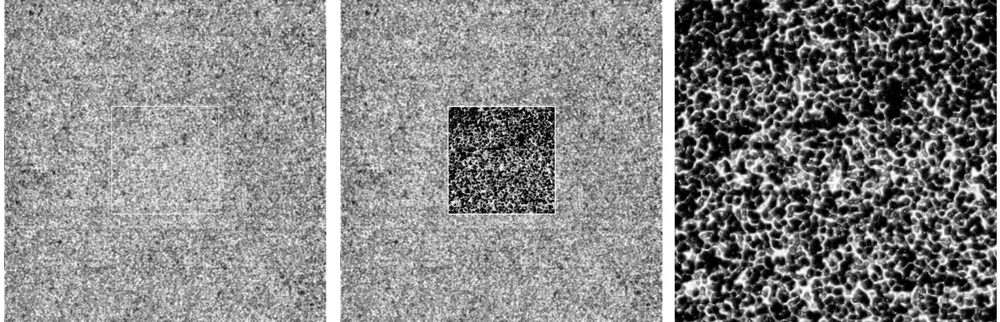
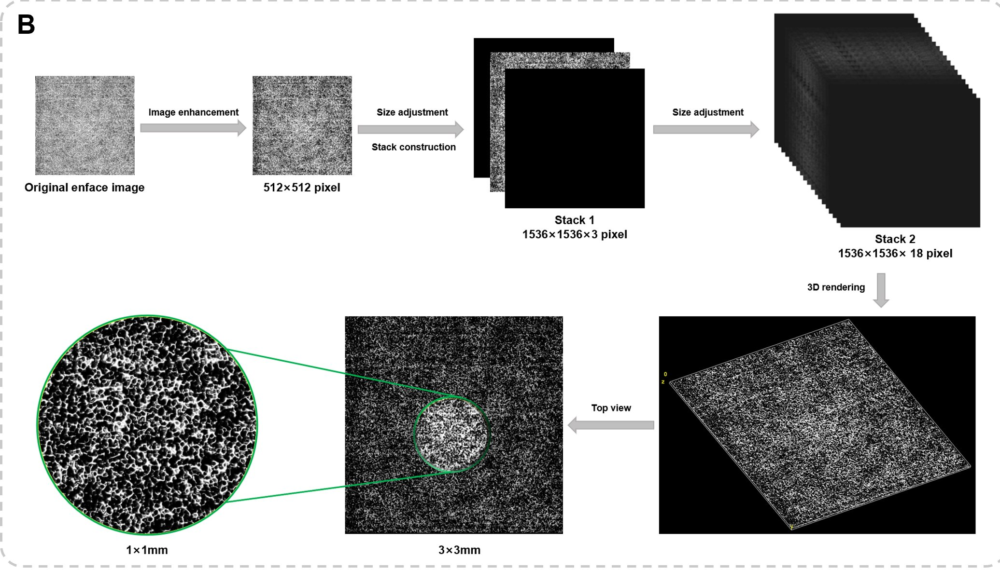
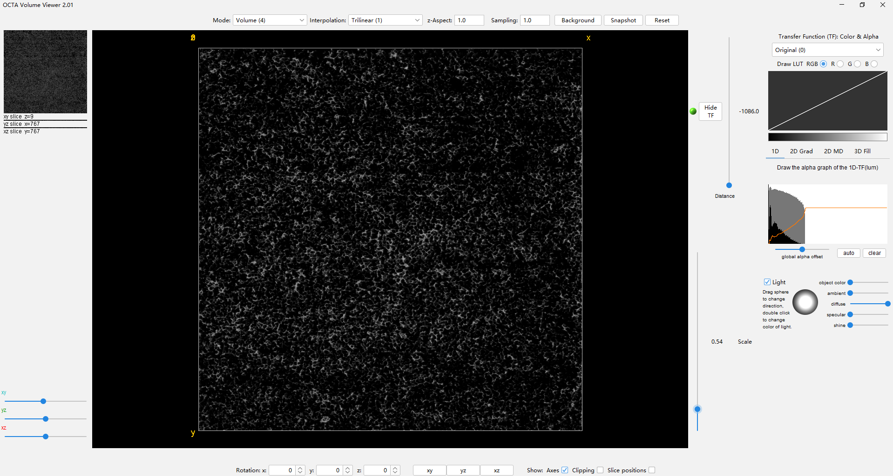

# ImageJ眼科学脉络膜血管OCTA图像3D重建插件
[English](README.md) | 简体中文

### 项目背景：
本研究拟在单张CC层 OCTA enface图像的基础上，基于enface图像特有的成像方式，通过二维转三维方法还原图像纵向信息，构建可以清晰展示CC血管形态的3D地形图。为验证3D重建算法的有效性，开发了本插件，本研究还设计了[OCTA_Volumer_Viewer](https://github.com/chw1127/OCTA_Volume_Builder)插件，用于在3D重建过程中，实时显示重建结果。

### 插件介绍：
本项目是在ImageJ中定制开发的图像处理插件。 与另外一款自己开发插件[OCTA_Volumer_Viewer](https://github.com/chw1127/OCTA_Volume_Builder)一起使用，
可以实现对单张OCTA图像进行3D视觉重建，并显示在OCTA_Volumer_Viewer中，效果如下：

### 原理示意图：

### 安装
1、前置条件：确保已经成功安装Fiji(ImajeJ发行版)。 下载地址：[https://imagej.net/software/fiji/](https://imagej.net/software/fiji/)

2、下载本插件的两个jar包：
[OCTA_3D_ReBuild_plugin-0.1.0.jar](./deploy/OCTA_3D_ReBuild_plugin-0.1.0.jar) 和 [OCTA_Volume_Viewer_plugin_2.01.5.jar](./deploy/OCTA_Volume_Viewer_plugin_2.01.5.jar)

3、将这两个jar包复制到Fiji(ImajeJ发行版)安装目录下的plugins文件夹中。
例如：你本机的安装目录可能是：D:\Program Files\Fiji.app-2023\plugins

4、运行Fiji(ImajeJ发行版)软件，在Plugins下拉菜单中即可看到这两个插件：“OCTA_3D_ReBuild”和“OCTA_Volume_Viewer”，说明安装成功。

### 使用
1、运行Fiji(ImajeJ发行版)软件

2、打开一张OCTA en-Face图像，如：

3、点击顶部菜单中“Plugins/OCTA_3D_ReBuild”,则会自动进行图像处理，并在“OCTA_Volume_Viewer”中预览。

4、点击“OK”,会自动合成最终的图，并自动弹出3D_Viewer插件打开预览3D效果：

